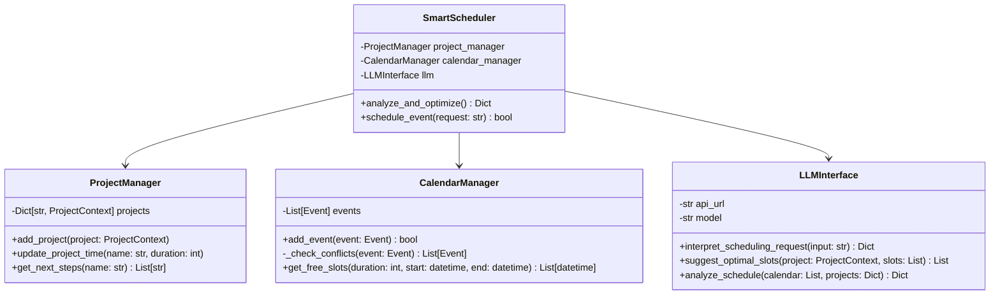
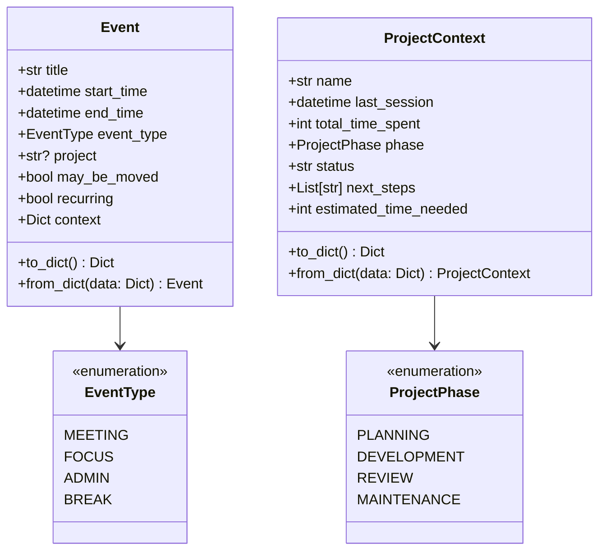
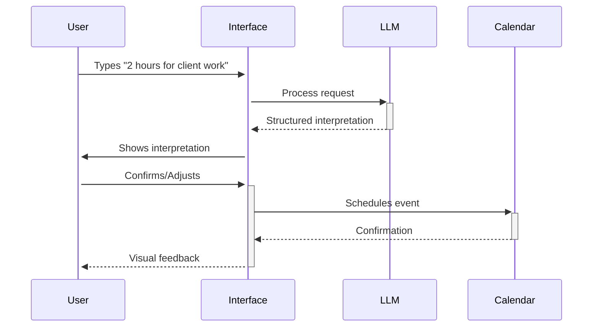
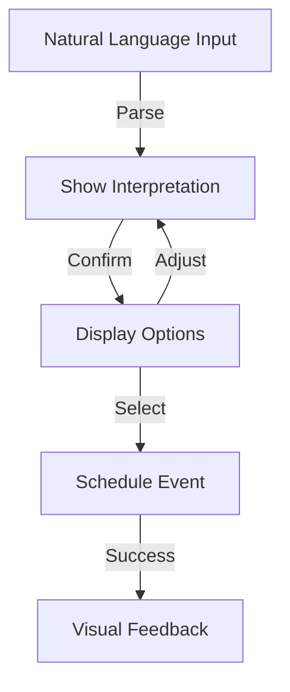

# Smart Calendar POC - Your AI-Powered Schedule Assistant

## Technical Architecture
### Class Structure



### Data Models



## What It Can Do Now

The POC demonstrates an intelligent calendar system that helps freelancers and individuals manage their time more effectively:

### 1. Natural Language Scheduling
```bash
# Example of current natural language understanding:
> python calendar_poc.py schedule
> "I need about 2 hours for the mobile app project tomorrow morning"

# The system understands and suggests optimal slots based on:
- Project context
- Your usual work patterns
- Available free time
- Energy levels throughout the day
```

### 2. Project Awareness
Currently tracks three sample projects showing how it:
- Remembers what you were last working on
- Knows each project's current phase and next steps
- Understands how much time you've invested
- Suggests scheduling based on project priorities

### 3. Smart Analysis
The `analyze` command provides insights about:
- How you spend your time
- Project progress tracking
- Potential schedule optimizations
- Work patterns and suggestions

### 4. Intelligent Scheduling
- Finds optimal time slots for tasks
- Prevents context switching
- Protects focus time
- Manages breaks effectively
- Handles recurring events

### Current Limitations
- Command line interface only
- No data persistence (resets on restart)
- No calendar sync
- Limited to basic scheduling scenarios
- No mobile access

## User Stories and Acceptance Criteria

### Core Functionality

1. **Natural Language Scheduling**
```
As a freelancer
I want to schedule tasks using natural language
So that I can quickly organize my day without complex forms

Acceptance Criteria:
- System understands inputs like "Schedule 2 hours for client project tomorrow morning"
- Provides confirmation with interpreted time, duration, and project
- Suggests multiple suitable time slots
- Shows rationale for each suggestion
- Allows quick selection of suggested slot
- Handles time zones correctly
- Manages conflicts with existing events
```

2. **Project Context Management**
```
As a freelancer
I want the system to understand my project context
So that it can make better scheduling decisions

Acceptance Criteria:
- Shows current phase of each project
- Tracks time spent per project
- Maintains list of next steps
- Updates automatically based on scheduled time
- Provides project progress insights
- Allows manual updates to project status
- Supports multiple concurrent projects
```

3. **Focus Time Protection**
```
As a knowledge worker
I want to protect my focus time
So that I can maintain productivity on complex tasks

Acceptance Criteria:
- Automatically blocks out focus time based on project needs
- Prevents scheduling interruptions during focus blocks
- Suggests optimal focus time slots based on energy levels
- Maintains minimum focus block duration (e.g., 2 hours)
- Allows emergency override with confirmation
- Tracks focus time effectiveness
```

4. **Schedule Analysis**
```
As a freelancer
I want to understand my time usage patterns
So that I can optimize my productivity

Acceptance Criteria:
- Shows daily/weekly/monthly time distribution
- Breaks down time by project and activity type
- Identifies productive periods
- Highlights potential schedule improvements
- Provides actionable optimization suggestions
- Tracks progress over time
- Exports reports in common formats
```

## User Interface Design


### Key Interface Patterns

1. **Natural Language Input**


2. **Smart Scheduling Flow**
The interface should guide users through a natural scheduling flow:



### UI Components

1. **Main Calendar View**
```
+----------------------------------+
|        Smart Calendar            |
+----------------------------------+
| Project  | Calendar | Analysis   |
+----------------------------------+
|"Schedule something..."           |
+----------------------------------+
|     Calendar Grid               |
|  +-------------------------+    |
|  |        Focus Time      |    |
|  |     Client Meeting     |    |
|  |     Break             |    |
|  +-------------------------+    |
|                               |
+----------------------------------+
|     Project Timeline           |
+----------------------------------+
```

2. **Project Dashboard**
```
+----------------------------------+
|   Project: Client Website        |
+----------------------------------+
| Phase: Development    Progress   |
| Time: 24h/40h        [====60%=] |
+----------------------------------+
| Next Steps:                      |
| ☐ Implement dark mode           |
| ☐ Fix navigation                |
| ☐ Update content                |
+----------------------------------+
| Recent Activity | Analytics      |
+----------------------------------+
```

### Interaction Design

1. **Quick Actions**
- Natural language input always visible
- One-click access to common actions
- Keyboard shortcuts for power users
- Drag-and-drop scheduling
- Quick project switching

2. **Smart Suggestions**
- Contextual time slot suggestions
- Energy level indicators
- Conflict warnings
- Break time reminders
- Focus time recommendations

3. **Visual Feedback**
- Color coding by project/type
- Progress indicators
- Time block visualization
- Schedule optimization hints
- Real-time updates

## Where It Could Go

### Near Future Potential

1. **Web & Mobile Interface**
   - Clean, intuitive calendar view
   - Project dashboard
   - Schedule insights visualization
   - Mobile-friendly design

2. **Enhanced Intelligence**
   - Learn your productive hours
   - Adapt to your work style
   - Suggest task grouping
   - Energy level optimization

3. **Calendar Integration**
   - Google Calendar sync
   - Apple Calendar sync
   - Outlook integration
   - Import existing schedules

4. **Advanced Analytics**
   - Productivity patterns
   - Focus time analysis
   - Project velocity tracking
   - Work-life balance metrics

### Long-term Vision

1. **Life Management**
   - Personal goal tracking
   - Habit formation support
   - Life-work balance optimization
   - Energy management

2. **Freelancer Tools**
   - Client project tracking
   - Billing time management
   - Deadline optimization
   - Capacity planning

3. **Optional Team Features**
   - Client meeting coordination
   - Contractor scheduling
   - Shared project timelines
   - Availability sharing

## Value for Users

### Current Benefits

1. **Time Savings**
   ```
   Average time saved per scheduling decision: 1-2 minutes
   × 5 scheduling decisions per day
   × 20 working days
   = 3.3 hours saved per month just on scheduling
   ```

2. **Better Focus**
   - Reduced context switching
   - Protected focus time blocks
   - Smart break scheduling
   - Project continuity maintenance

3. **Project Clarity**
   - Clear next steps
   - Progress tracking
   - Time investment awareness
   - Priority management

### Real User Scenarios

1. **Freelance Developer**
   - Balances multiple client projects
   - Protects deep work time
   - Tracks billable hours effectively
   - Manages project deadlines

2. **Content Creator**
   - Schedules content creation blocks
   - Manages posting schedules
   - Balances creation and editing
   - Tracks project progress

3. **Independent Consultant**
   - Organizes client meetings
   - Schedules preparation time
   - Manages multiple engagements
   - Tracks project deliverables

## Getting Started

1. **Setup**
   ```bash
   git clone https://github.com/KaiserRuben/Kairos.git
   cd Kairos
   pip install -r requirements.txt
   ```

2. **Basic Usage**
   ```bash
   # View schedule analysis
   python kairos.py analyze
   
   # Schedule new tasks
   python kairos.py schedule
   ```

## Future Monetization Model

### Individual Plans

1. **Free Tier**
   - Basic calendar management
   - Simple project tracking
   - Standard analytics
   - Web access

2. **Pro Plan ($8/month)**
   - Advanced AI suggestions
   - Unlimited projects
   - Extended analytics
   - Calendar sync
   - Mobile app access
   - Priority support

3. **Add-ons**
   - Custom integrations
   - Advanced reports
   - Client portal
   - Team features

### Pricing Philosophy
- Focus on individual value
- Pay for power features
- Keep core features accessible
- Scale with user needs